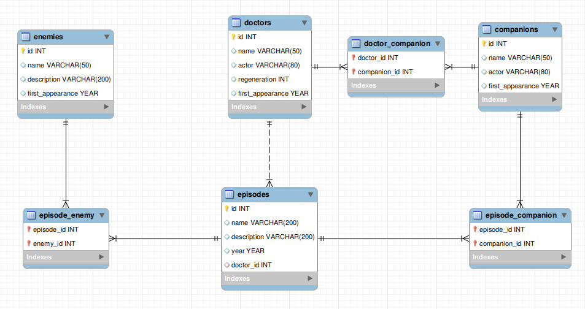

# Doctor-Who-DataBase

This is the final exercise of the **"Introduction to Data & SQL"** course by **Code First Girls** 

The online version of the presentation is available [here](https://www.canva.com/design/DAGWTVfIB5U/jpuaOQBb-4KVkLCuWhtS8g/view?utm_content=DAGWTVfIB5U&utm_campaign=designshare&utm_medium=link&utm_source=editor)

You can also download the presentation in pdf format [here](https://github.com/datasilvia/Doctor-Who-DataBase/blob/main/Doctor-Who-DataBase.pdf).

I discovered **Doctor Who** with the Eleventh Doctor.
I was fascinated by the stories, the settings, the characters... In addition, I think that the series promotes positive values ​​such as friendship, kindness and humility.

The Doctor Who series is certainly also adventure, fantasy and makes you interested in history, among other things because of the appearance of various historical characters.

Some of its settings are really unique, for example, there is a chapter in Stonehenge.

Thanks to this series I decided to make a couple of trips to London and Cardiff, in order to attend the Doctor Who Experience that was held there.
And yes, I also visited Stonehenge.

On the 50th anniversary of the series I was also able to see the premiere of the special chapter in the cinema in my city.

## Reasons for Choosing the Doctor Who Theme

1.- **Rich and Expansive Universe**: Doctor Who is the longest-running and most beloved science fiction series, with a vast universe filled with diverse characters, settings, and plot arcs. This expansive content offers an excellent foundation for creating a complex and engaging database.

2.- **Variety of Data Types**: The Doctor Who universe includes various elements, such as Doctors, companions, enemies, episodes, and story arcs. This diversity allows for different types of data relationships and provides an opportunity to showcase advanced database design skills, including many-to-many relationships, subqueries, and views.

3.- **Potential for Complex Queries and Analysis**: With a wide range of interconnected data, this theme allows for the creation of complex queries that reveal interesting insights. For example, analyzing recurring villains, exploring the dynamics between different Doctors and their companions.

4.- **Popular Cultural Appeal**: As an iconic cultural phenomenon, Doctor Who is familiar to many people, making the project interesting and relatable. This also adds value to the project as it demonstrates a practical example of how databases can be used to explore and analyze popular media.

5.- **Historical and Thematic Depth**: Doctor Who covers various themes, from time travel to moral dilemmas, and has evolved over decades, reflecting changes in storytelling and technology. This adds an additional layer of depth to the project, making it not just a technical exercise but also an exploration of thematic elements within the show.

When I started doing this project I realized the huge amount of data that exists on this topic, and I decided to use only a small part of it.
I hope to complete this exercise little by little, with more time and experience in the subject.

## The Database: 

I created a small database like this:

First I created the **tables** and I filled in their attributes:

    CREATE TABLE doctors(
	    id INT PRIMARY KEY,
	    name VARCHAR(50),
	    actor VARCHAR(80),
	    regeneration INT,
	    first_appearance YEAR);

    CREATE TABLE companions(
	    id INT PRIMARY KEY,
	    name VARCHAR(50),
	    actor VARCHAR(80),
	    first_appearance YEAR);

    CREATE TABLE doctor_companion (
        doctor_id INT,
        companion_id INT,
        PRIMARY KEY (doctor_id, companion_id),
        FOREIGN KEY (doctor_id) REFERENCES doctors(id),
        FOREIGN KEY (companion_id) REFERENCES companions(id));

    CREATE TABLE enemies(
	    id INT PRIMARY KEY,
	    name VARCHAR(50),
	    description VARCHAR(200),
	    first_appearance YEAR);

    CREATE TABLE episodes(
	    id INT PRIMARY KEY,
	    name VARCHAR(200),
	    description VARCHAR(200),
        year YEAR,
        doctor_id INT,
        FOREIGN KEY (doctor_id) REFERENCES doctors(id));

    CREATE TABLE episode_enemy(
        episode_id INT,
        enemy_id INT,
        PRIMARY KEY (episode_id, enemy_id),
        FOREIGN KEY (episode_id) REFERENCES episodes(id),
        FOREIGN KEY (enemy_id) REFERENCES enemies(id));
    
    CREATE TABLE episode_companion (
        episode_id INT,
        companion_id INT,
        PRIMARY KEY (episode_id, companion_id),
        FOREIGN KEY (episode_id) REFERENCES episodes(id),
        FOREIGN KEY (companion_id) REFERENCES companions(id)
    );

    

Then I used **INSERTS** to fill in the data.

Later I created a **view**:

   
    CREATE VIEW episode_details AS
    SELECT 
        e.id AS episode_id,
        e.name AS episode_name,
        e.description AS episode_description,
        e.year AS episode_year,
        d.name AS doctor_name,
        c.name AS companion_name,
        en.name AS enemy_name

    FROM 
        episodes e
    JOIN 
        doctors d ON e.doctor_id = d.id
    LEFT JOIN 
        episode_companion ec ON e.id = ec.episode_id
    LEFT JOIN 
        companions c ON ec.companion_id = c.id
    LEFT JOIN 
        episode_enemy ee ON e.id = ee.episode_id
    LEFT JOIN 
        enemies en ON ee.enemy_id = en.id;

    

Two **functions**:

    DROP FUNCTION IF EXISTS count_enemy_episodes;

    DELIMITER //

    CREATE FUNCTION count_enemy_episodes(input_enemy_id INT)
    RETURNS INT
    DETERMINISTIC
    BEGIN
        DECLARE episode_count INT;
    
        SELECT COUNT(DISTINCT episode_id) INTO episode_count
        FROM episode_enemy
        WHERE enemy_id = input_enemy_id;

        RETURN episode_count;
    END //

    DELIMITER ;

    SELECT 
        e.name AS enemy_name,
        count_enemy_episodes(e.id) AS total_episodes
    FROM 
        enemies e;

    DROP FUNCTION IF EXISTS count_doctor_companions;

    DELIMITER //

    CREATE FUNCTION count_doctor_companions(input_doctor_id INT)
    RETURNS INT
    DETERMINISTIC
    BEGIN
        DECLARE companion_count INT;

        SELECT COUNT(DISTINCT companion_id) INTO companion_count
        FROM doctor_companion
        WHERE doctor_id = input_doctor_id;

        RETURN companion_count;
    END //

    DELIMITER ;

    SELECT 
        d.name AS doctor_name,
        count_doctor_companions(d.id) AS total_companions
    FROM 
        doctors d;

And an **example query**:

    SELECT 
        d.name AS doctor_name,
        COUNT(DISTINCT e.id) AS total_enemy_episodes
    FROM 
        doctors d
    JOIN 
        episodes e ON d.id = e.doctor_id
    JOIN 
        episode_enemy ee ON e.id = ee.episode_id
    WHERE 
        d.id = (
            SELECT doctor_id
            FROM episodes e
            JOIN episode_enemy ee ON e.id = ee.episode_id
            GROUP BY e.doctor_id
            ORDER BY COUNT(DISTINCT e.id) DESC
            LIMIT 1
        )
    GROUP BY d.name;

You can see the **ERD** diagram here:

### Future Improvements

1. **Add Seasons and Series Data**: Organize episodes by seasons and series to facilitate season-based analyses.
2. **Story Arc Table**: Create a table for multi-episode story arcs to analyze thematic continuity.
3. **Secondary Villains and Guest Stars**: Track one-off villains and guest actors for deeper character studies.
4. **Direct Doctor-Enemy Relationship**: Establish a direct relationship between Doctors and their recurring enemies.
5. **Locations**: Add a table for locations to see where the Doctor’s adventures take place.
6. **Genre or Theme Classification**: Add genres/themes to episodes for analysis of narrative variety.
7. **Performance Optimization with Indexes**: Use indexes on frequently joined columns to improve query performance.
8. **Regeneration Events**: Detail each Doctor’s regeneration circumstances for continuity analysis.
9. **Key Objects/Technology**: Track notable objects like the Sonic Screwdriver across episodes.
10. **Implement Data Integrity Triggers**: Add triggers to ensure data consistency when adding or updating records.

## Interesting reads and resources about Doctor Who:

https://s.telegraph.co.uk/graphics/projects/doctor-who/

https://m.imdb.com/search/title/?count=250&series=tt0436992&sort=user_rating,desc

https://tardis.fandom.com/wiki/Doctor_Who_Wiki

https://www.bbc.co.uk/programmes/articles/4tDN85fyxYXTtVPrCql8jB/monsters

https://www.ign.com/articles/2018/07/18/doctor-who-a-guide-to-all-the-doctors

https://drwho.theplanetarium.org/

